# SVG 入门介绍

> 主要写给设计、前端开发做分享的，SVG 相关的入门知识

## 前言

关于为什么要去学习 SVG？

~~没有为什么，多学一个实用的技术没有任何拒绝的理由。~~

PNG、JPG、GIF、SVG……网页中能支持的图片格式有很多，每一个图片格式都有着它自己的特性和最适合的场景。而其中 SVG 很容易可以作为最特殊的一种被区分出来——它是矢量图片储存的格式。加上他本身基于 XML 标记语言，和HTML 天然的相性，使得它在 web 开发中尤其能发挥独特的作用（交互/滤镜）。

我认为前端视觉部分的工具有四大类：CSS、SVG、Canvas(2d context)、Webgl。而这四个工具的设计逻辑、使用方式、呈现效果都有着天壤之别。没有前端开发会不懂 CSS，但是后三者似乎不会在一般的前端培训 or学习路径上被提及。而再其中，SVG 是一个门槛不高，但使用场景很大，使用方式很灵活的一个工具。熟悉掌握 SVG 这一工具能够有效提高前端开发的质量。

## 什么是 SVG

**可缩放矢量图形（Scalable Vector Graphics，SVG）**

> 可缩放矢量图形（Scalable Vector Graphics，SVG）基于 XML 标记语言，用于描述二维的矢量图形。
>
> 作为一个基于文本的开放网络标准，SVG 能够优雅而简洁地渲染不同大小的图形，并和CSS、DOM、JavaScript 和 SMIL 等其他网络标准无缝衔接。本质上，SVG 相对于图像，就好比 HTML 相对于文本。
>
> SVG 图像及其相关行为被定义于 XML 文本文件之中，这意味着可以对它们进行搜索、索引、编写脚本以及压缩。此外，这也意味着可以使用任何**文本编辑器**和绘图软件来创建和编辑它们。
>
> 和传统的点阵图像模式（如 JPEG 和 PNG）不同的是，SVG 格式提供的是矢量图，这意味着它的图像能够被无限放大而不失真或降低质量，并且可以方便地修改内容，无需图形编辑器。通过使用合适的库进行配合，SVG 文件甚至可以随时进行本地化。
>
> SVG 是由万维网联盟（W3C）自 1999 年开始开发的开放标准。
>
> from https://developer.mozilla.org/zh-CN/docs/Web/SVG

### 矢量图&位图

[](https://pediaa.com/what-is-the-difference-between-bitmap-and-vector/)

通俗来讲：

位图通过各种（压缩）方式来最终储存：坐标 x、y 处应该是什么颜色……

矢量图记录：这里有一条黑色的直线、这里有一个红色的圆……

### 长什么样子

[](images/24-hours-line.svg)

```svg
<svg xmlns="http://www.w3.org/2000/svg" viewBox="0 0 24 24" width="120" height="120">
  <path fill="none" d="M0 0H24V24H0z" />
  <path
    d="M12 13c1.657 0 3 1.343 3 3 0 .85-.353 1.616-.92 2.162L12.17 20H15v2H9v-1.724l3.693-3.555c.19-.183.307-.438.307-.721 0-.552-.448-1-1-1s-1 .448-1 1H9c0-1.657 1.343-3 3-3zm6 0v4h2v-4h2v9h-2v-3h-4v-6h2zM4 12c0 2.527 1.171 4.78 3 6.246v2.416C4.011 18.933 2 15.702 2 12h2zm8-10c5.185 0 9.449 3.947 9.95 9h-2.012C19.446 7.054 16.08 4 12 4 9.25 4 6.824 5.387 5.385 7.5H8v2H2v-6h2V6c1.824-2.43 4.729-4 8-4z"
    fill="rgba(50,152,219,1)" />
</svg>
```

**TODO**

## 展示

一个可以交互的 SVG by [https://commons.wikimedia.org/wiki/SVG_examples](https://commons.wikimedia.org/wiki/SVG_examples)

[](images/anim.svg)
